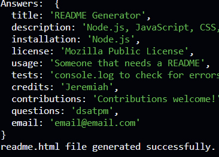

# README Generator

This is a program that creates a professional README in an HTML file that is created entirely from Node.js. Answer the series of prompts, and your README will be generated automatically!

-   I wanted to create a nice looking README generator that was very user-friendly
-   I built this project to streamline the sometimes tedious task of creating a README for a project
-   It saves tons of time for the developer!
-   I learned how to use Node.js to create a series of files
    -   Learning how to apply CSS properties was a particular challenge
    -   Also learning how to apply JavaScript functions was a challenge

## Installation

It is required to install Node.js to your machine to run this program. Here is how to do it:

#### For MacOS

```bash
brew install node
```

#### For Windows

```bash
scoop install nodejs
```

#### For Linux

```bash
apk add nodejs npm
```

Next, copy my application by going [here](https://github.com/dsatpm/readme_app).

-   Click on the green 'Code' icon and copy the URL _or_ SSH Key. Information on how to do that can be found [here](https://docs.github.com/en/repositories/creating-and-managing-repositories/cloning-a-repository).
-   Once cloned, open 'readme_app' in your IDE of choice (I use [VSCode](https://code.visualstudio.com/)).

## Usage

Here are some screenshots of how to navigate the program:

### Start here
#### Run this in your Terminal


#### Prompts in the terminal:

<br>
<br>
<br>
<br>
#### README.html created!!


#### Finished product!


#### Live Demo
[Here](https://drive.google.com/file/d/1DgSio52Ks6uMFiYB8Tc56bQmKz0CbDDR/view?usp=drive_link) is the video demo.

## Credits

This project was made entirely with [Node.js](https://nodejs.org/en) and [Inquirer](https://www.npmjs.com/package/inquirer), and was created by [me](https://github.com/dsatpm).
##### Other Sources Used:

-   [ChatGPT](https://chat.openai.com/) for finding bugs and inconsistencies in my code
-   [Stack Overflow](https://stackoverflow.com/) for Node.js help
-   [Google Fonts](https://fonts.google.com/) for some cool-looking font-families
-   [Node.js](https://nodejs.org/en) for installation and troubleshooting
-   [Inquirer](https://www.npmjs.com/package/inquirer) which provided the console prompt functionality

## License

[](https://opensource.org/licenses/MIT)

## Contributions

Please refer to the [Contributor Covenant](https://www.contributor-covenant.org/) for details on how to contribute
